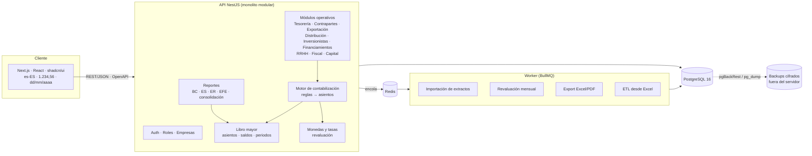

# 01 · Arquitectura

## 1. Visión general

Monolito modular: un único backend con módulos de dominio bien separados, una
sola base PostgreSQL y un frontend web. No conviene empezar con microservicios.
El volumen (millones de líneas a medio plazo) y los usuarios (decenas) caben de
sobra en un monolito, y la partida doble exige transacciones ACID entre módulos:
una factura y su asiento se confirman juntos o no se confirman.



## 2. Stack propuesto

| Capa | Elección | Por qué / alternativa descartada |
|---|---|---|
| Lenguaje | **TypeScript** (estricto) en todo el monorepo | Tipos compartidos front/back y un único lenguaje para el ETL. |
| Monorepo | **pnpm workspaces + Turborepo** | Builds y tests incrementales. |
| Backend | **NestJS 11** (API separada) | Encaja mejor que las API routes de Next.js porque tenemos inyección de dependencias para el motor contable, workers, OpenAPI automático (`@nestjs/swagger`) y guards de permisos por empresa. Next.js API routes servirían para CRUD, pero no para jobs largos ni para un motor transaccional. |
| ORM | **Prisma 6** para el esquema, las migraciones y el CRUD. **SQL tipado** (Prisma TypedSQL) para reportes y saldos | Prisma no expresa triggers, constraints diferidos ni vistas. Esas piezas van en migraciones SQL versionadas dentro de la misma carpeta `prisma/migrations`. Alternativa: Drizzle/Kysely, con mejor SQL pero un ecosistema de migraciones menos maduro. Prisma + SQL crudo donde haga falta es el punto medio. |
| Base de datos | **PostgreSQL 16** | `NUMERIC(18,4)` para importes, `NUMERIC(20,10)` para tasas (ver §5), constraints diferidos, RLS, particionado si hace falta. |
| Aritmética | **decimal.js** en TS; nunca `number` para dinero | Prisma devuelve `Decimal`. Una regla de ESLint prohíbe `parseFloat`/`Number()` en módulos de dinero. |
| Validación | **Zod** (esquemas compartidos en `packages/shared`) | La misma validación en el formulario y en la API. |
| Colas | **BullMQ + Redis** | Importaciones, revaluación, exportaciones pesadas y ETL fuera del ciclo de la petición. |
| Frontend | **Next.js 15 (App Router) + React + Tailwind + shadcn/ui** | Tal como sugeriste. |
| Tablas | **TanStack Table** con paginación, filtro y orden **en servidor** | Para la vista tipo Excel del libro diario y la conciliación, AG Grid Community si hace falta edición masiva. |
| Formularios | react-hook-form + Zod | |
| Exportación | **ExcelJS** (xlsx con formatos y fórmulas de total) y **Playwright → PDF** (HTML imprimible) | El PDF sale de la misma plantilla HTML que ves en pantalla. |
| Auth | Sesión con **JWT de acceso corto + refresh en cookie httpOnly**, contraseñas Argon2id, **2FA TOTP** obligatorio para Admin y Contador | Alternativa: Auth.js o Keycloak si más adelante queréis SSO. |
| Permisos | **CASL** (rol × acción × empresa) + **RLS de PostgreSQL** como segunda barrera por `company_id` | Aunque haya un bug en la API, un usuario de KEI no puede leer DM. |
| Tests | **Vitest** (unitarios y de integración con Postgres real vía Testcontainers) + **Playwright** (E2E) | Las reglas contables se prueban contra una base real, no contra mocks. |
| Calidad | ESLint, Prettier, `tsc --noEmit`, Husky + lint-staged | |
| CI | **GitHub Actions**: lint → typecheck → unit → integración (servicio Postgres) → E2E → build de imágenes | |
| Dev | **Docker Compose**: postgres, redis, api, worker, web, mailpit, adminer | `make dev` / `pnpm dev`. |
| Observabilidad | Logs JSON (pino), healthchecks, Sentry opcional | |

## 3. Estructura del repositorio

```
kaluch-erp/
├─ apps/
│  ├─ api/                 NestJS
│  │  └─ src/modules/
│  │     ├─ core/          empresas, segmentos, dimensiones, usuarios, auditoría
│  │     ├─ ledger/        plan de cuentas, asientos, periodos, saldos
│  │     ├─ fx/            monedas, tasas, revaluación
│  │     ├─ posting/       motor de reglas de contabilización
│  │     ├─ treasury/      caja, bancos, extractos, conciliación, traspasos
│  │     ├─ parties/       contrapartes, cuentas corrientes, remesas, liquidaciones
│  │     ├─ export/        facturas exportación, costos, comisiones, ponderación
│  │     ├─ distribution/  contenedores, productos, inventario, facturación, comisiones
│  │     ├─ investors/     inversiones por contenedor
│  │     ├─ financing/     préstamos
│  │     ├─ hr/            nómina, acreditación, prorrateos
│  │     ├─ tax/           impuestos y cierres fiscales
│  │     ├─ equity/        capital
│  │     └─ reports/       BC, ES, ER, EFE, consolidación, dashboard
│  ├─ worker/              procesos BullMQ (reutiliza los módulos de api)
│  └─ web/                 Next.js
├─ packages/
│  ├─ shared/              Zod, tipos, utilidades de dinero y fechas (es-ES)
│  ├─ db/                  schema.prisma, migraciones, SQL tipado, seeds
│  └─ etl/                 lectores del .xlsx, mapeos documentados y conciliación con BC
├─ docker/  docs/  .github/workflows/
```

**Regla de dependencias:** los módulos operativos **nunca** escriben en
`journal_entry` directamente. Llaman a `PostingService.post(document)`, y ese
servicio es el único con permiso para crear asientos. Lo verifica una regla de
lint (`eslint-plugin-boundaries`).

## 4. Multi-empresa y seguridad

- **Una sola base de datos.** Cada tabla de negocio lleva `company_id`. No usamos
  un esquema por empresa porque la consolidación y las operaciones
  intercompañía cruzan empresas constantemente.
- **Roles configurables**: conjuntos editables de permisos atómicos
  (`recurso:acción`), asignados **por empresa** en `user_company_role`. Un
  usuario puede ser Cajero en DM y Solo lectura en KEI. Roles semilla:
  Superadministrador, Contador, Cajero, Conciliador, Fiscal, Comercial y
  Ventas, Almacén y Solo lectura. La matriz completa está en
  [05 §2](05-decisiones-y-preguntas.md).
- **Acceso por recurso**: un cajero solo ve sus cajas y un vendedor solo sus
  ventas y comisiones.
- **Vista por defecto: Grupo consolidado.** La empresa es un filtro.
- **Auditoría:** un trigger genérico guarda en `audit_log` el antes y el después
  (JSONB) de cada `INSERT`/`UPDATE` con el usuario de la sesión (`SET LOCAL
  app.user_id`). Los asientos contabilizados son inmutables: un trigger rechaza
  `UPDATE`/`DELETE`, y la única forma de corregir es anular con contra-asiento.
- **Sin borrados físicos** en documentos ni asientos. Los catálogos usan `active=false`.

## 5. Decisiones técnicas relevantes

1. **Importes en `NUMERIC(18,4)` y tasas en `NUMERIC(20,10)`.** Cuatro
   decimales no bastan para una tasa: con CUP/USD ≈ 400, la tasa inversa
   0,0025 pierde precisión a 4 d. El importe en USD se calcula y redondea a 4 d
   (half-even) **en la línea**. El descuadre que deja el redondeo en asientos
   multimoneda se lleva a una cuenta de redondeo, con una tolerancia máxima
   configurable (p. ej. 0,01 USD).
2. **Signo único.** `amount` (en la moneda original) y `amount_usd` van con
   signo: positivo es Debe y negativo es Haber. Un asiento cuadra si
   `SUM(amount_usd) = 0`. Las sumas son triviales y en pantalla se presentan
   columnas Debe/Haber.
3. **Saldos materializados.** La tabla `ledger_balance` (empresa × libro ×
   periodo × cuenta × segmento × moneda) se actualiza **en la misma transacción**
   que contabiliza el asiento. El BC de un mes se lee de ahí, sin
   recorrer millones de líneas. Un job nocturno recalcula y compara
   (autochequeo).
4. **Libro Real y libro Fiscal.** Cada asiento lleva `book ∈ {BASE, REAL,
   FISCAL}`. La vista Real suma BASE + REAL y la Fiscal/Presentado suma BASE +
   FISCAL. Así un mismo hecho no se duplica, y los ajustes fiscales (costo
   fiscal del contenedor, PV fiscal) viven solo en su libro.
5. **Reglas de contabilización: lógica en código, cuentas en configuración.**
   Cada tipo de documento tiene un *handler* probado (qué patas genera) y las
   cuentas concretas salen de una tabla `account_mapping` editable (p. ej.
   "venta minorista Distribución" → 9xx.yy por empresa/segmento). Un lenguaje
   de reglas 100 % configurable desde la UI sería frágil y muy difícil de
   probar. Ver [03](03-motor-contable.md).
6. **API REST + OpenAPI 3.1** generada desde los DTOs, versionada en `/api/v1`.
   Las integraciones futuras (Stripe, Tropipay, bancos) entran como
   *importadores* de extractos que generan los mismos documentos que la UI.
7. **Idempotencia.** Las operaciones de creación aceptan `Idempotency-Key`, para
   que no se dupliquen ni los reintentos con mala conexión ni las importaciones
   de extractos repetidas (hash de cada línea de extracto).
8. **Fechas.** Fecha contable `DATE` (sin hora ni zona). Las marcas de auditoría
   van en `TIMESTAMPTZ`. La zona horaria de la UI es configurable por usuario
   (Cuba, RD y España tienen husos distintos).

## 6. Despliegue

- **Producción:** **VPS de Hostinger** (KVM 2, centro de datos en la UE) con
  Docker Compose y Caddy (HTTPS) en **`kgtaccounting.com`**. El hosting web
  compartido no sirve porque no tiene PostgreSQL. Detalle en
  [05 §1](05-decisiones-y-preguntas.md). Backups con **pgBackRest**: un completo semanal,
  incrementales diarios y WAL continuo para restaurar a un punto en el tiempo,
  todo replicado y cifrado fuera del servidor (S3-compatible). La
  restauración se prueba de forma automática una vez al mes.
- **Entornos:** `dev` (Compose local), `staging` (datos migrados anonimizados) y
  `prod`.
- **Conectividad:** parte del equipo trabaja desde Cuba. La UI se diseña para
  enlaces lentos: paginación en servidor, respuestas comprimidas, sin
  dependencias de CDN bloqueadas en Cuba y formularios que conservan el borrador
  en local si se corta la conexión.
