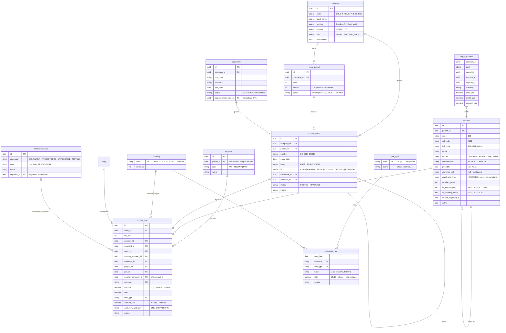
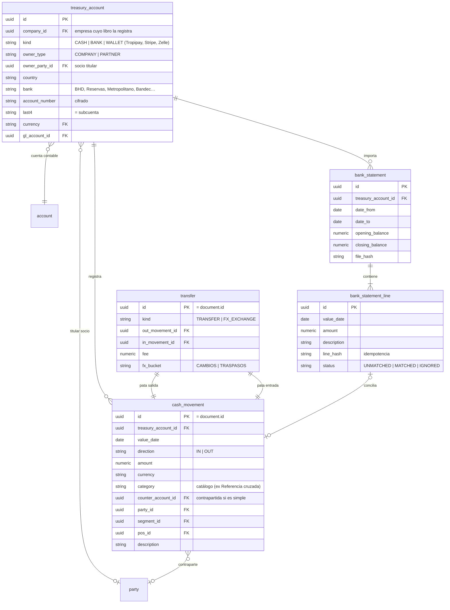
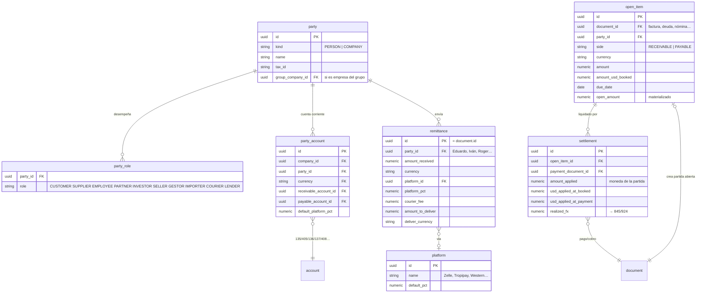
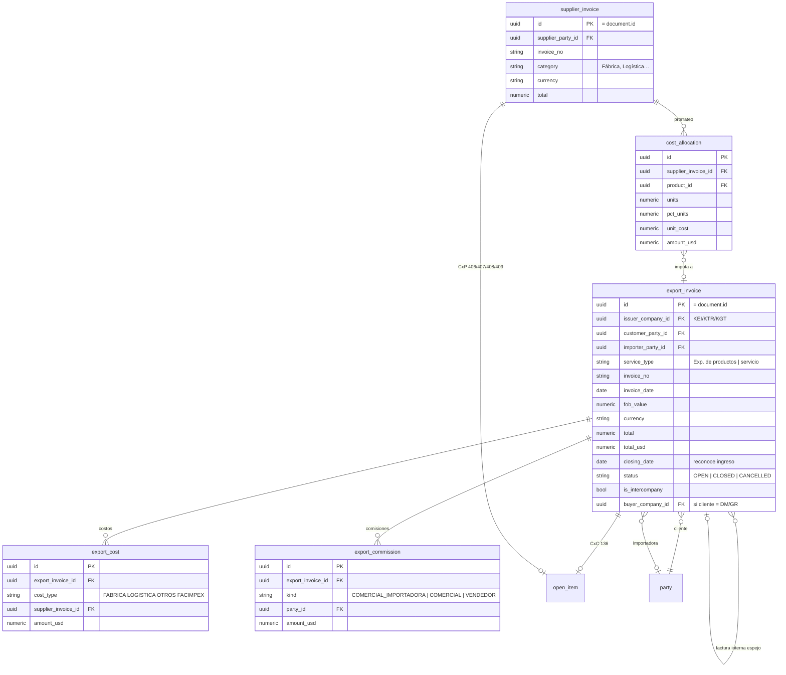
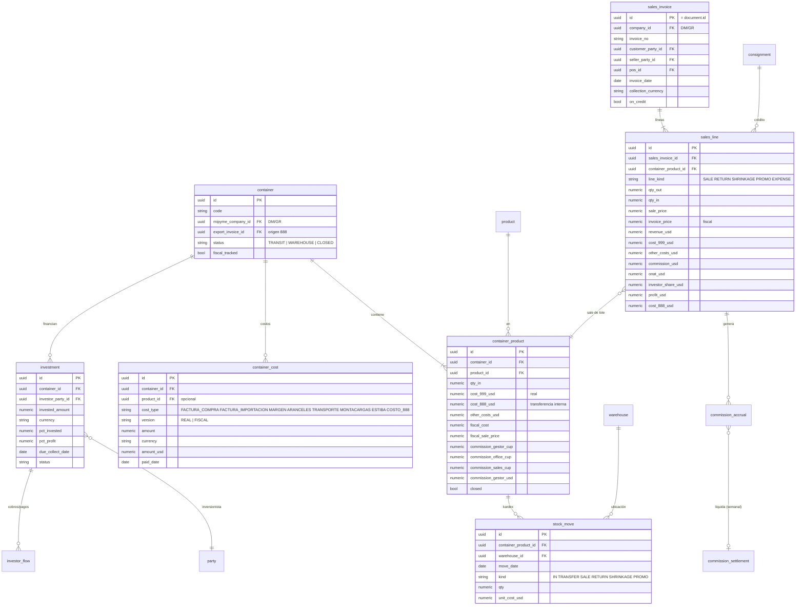

# 02 · Modelo de datos (ERD)

Convenciones:
- PK `id UUID` (v7, ordenable por tiempo) en todas las tablas.
- Importes `NUMERIC(18,4)`, tasas `NUMERIC(20,10)`, porcentajes `NUMERIC(9,6)`.
- Todas las tablas de negocio llevan `company_id`, `created_at`, `created_by`,
  `updated_at` y `updated_by`.
- Los documentos tienen estado `DRAFT → POSTED → VOIDED`. Un documento `POSTED`
  es inmutable y para corregirlo se anula (contra-asiento) y se crea uno nuevo.
- Los nombres de tabla y columna van en inglés (convención técnica). Todo lo
  visible en la UI va en español.

Para que sea legible, el ERD se divide en 6 diagramas.

## 1. Núcleo: organización, monedas y libro mayor

**Restricciones clave (SQL en migraciones):**
- `CONSTRAINT TRIGGER … DEFERRABLE INITIALLY DEFERRED`: al hacer COMMIT, cada
  asiento debe cumplir `SUM(amount_usd) = 0`.
- `CHECK (sign(amount) = sign(amount_usd) OR amount = 0)`.
- Solo se puede imputar a cuentas `postable = true`. Si la cuenta tiene
  `requires_party`, la línea debe llevar `party_id`.
- No se puede contabilizar en un periodo `LOCKED`. En uno `SOFT_CLOSED`, solo el rol Contador.
- `journal_entry`/`journal_line` con estado POSTED: cualquier `UPDATE`/`DELETE`
  se rechaza.
- Índices: `journal_line (company_id, account_id, entry_date)`,
  `(party_id, entry_date)`, `(container_id)`, `(treasury_account_id, entry_date)`.
  `company_id` y `entry_date` se desnormalizan en `journal_line` para que estos
  índices funcionen.
- `exchange_rate`: única por `(rate_date, currency, rate_type, base)`.

> **Por qué `document` como supertipo.** Cada módulo tiene su tabla de detalle
> (`cash_movement`, `sales_invoice`…) con `id` = `document.id` (1:1). Así
> cualquier pago puede apuntar con FK a cualquier documento que liquida
> (`settlement`), la auditoría es uniforme y la trazabilidad "asiento → documento
> → fila del Excel de origen" es directa.

## 2. Tesorería

## 3. Contrapartes, deudas y liquidaciones

- **Partidas abiertas (`open_item`)** sustituyen a la "Referencia cruzada" como
  vínculo real: una factura crea una partida abierta y cada pago la liquida
  (total o parcial) con FK.
- **Zelle Invictus (traspaso de deuda entre personas):** es un documento
  `DEBT_ASSIGNMENT` que cancela la partida con Adrián y abre otra con Luiso.
- **UNIR:** contraparte de rol PARTNER con cuenta 413 (deuda con socios) y
  pagos anticipados 146.

## 4. Exportación

## 5. Distribución, inventario e inversionistas

`sales_line` **guarda** los importes calculados (ingreso, costos, ONAT, utilidad)
en el momento de contabilizar, con la versión de los parámetros usados. Así un
cambio posterior de parámetros no reescribe el pasado.

## 6. Financiamientos, RRHH, fiscal, capital, revaluación, ETL, seguridad

```mermaid
erDiagram
  loan ||--o{ loan_flow : movimientos
  loan ||--o{ loan_accrual : devengos
  employee ||--o{ payroll_line : cobra
  payroll_run ||--|{ payroll_line : contiene
  payroll_line ||--o| open_item : "455 nómina por pagar"
  allocation_rule ||--|{ allocation_share : reparte
  tax_obligation ||--o{ tax_accrual : devenga
  tax_obligation ||--o{ tax_period_close : cierra
  equity_movement }o--|| party : socio
  fx_revaluation_run ||--|{ fx_revaluation_line : detalle
  fx_revaluation_run ||--|| journal_entry : asiento
  import_batch ||--|{ import_row : filas
  import_row ||--o| review_item : "si no clasifica"
  app_user ||--o{ user_company_role : tiene
  role ||--o{ user_company_role : asignado
  role ||--|{ role_permission : incluye
  app_user ||--o{ user_resource_scope : "acotado a"
  audit_log }o--|| app_user : autor
  parameter ||--o{ parameter_version : vigencias

  loan {
    uuid id PK "= document.id"
    string direction "GIVEN (G) | RECEIVED (I)"
    uuid party_id FK
    numeric principal
    numeric rate_pct
    string currency
    date start_date
    date end_date
    string term "CORTO 138/411 | LARGO 520"
  }
  payroll_run {
    uuid id PK
    uuid company_id FK
    date period_date
  }
  payroll_line {
    uuid id PK
    uuid employee_id FK
    numeric gross
    numeric attendance_discount
    numeric mipyme_salary_discount
    numeric net
    string currency
    numeric pct_export
    numeric pct_distribution
  }
  allocation_rule {
    uuid id PK
    string name "Comunicación, Salario compartido"
  }
  tax_obligation {
    uuid id PK
    string agency "ONAT | DGII | HACIENDA"
    string tax_code "R17, IT1, I12, IVA, TSS, INFOTEP…"
    string periodicity "MENSUAL | TRIMESTRAL | ANUAL"
  }
  equity_movement {
    uuid id PK "= document.id"
    string kind "APORTE | RETIRO | DISTRIBUCION"
    uuid partner_party_id FK
    numeric amount_usd
  }
  fx_revaluation_run {
    uuid id PK
    uuid company_id FK
    uuid period_id FK
    string status
  }
  fx_revaluation_line {
    uuid account_id FK
    uuid party_id FK
    string currency
    numeric balance_orig
    numeric booked_usd
    numeric closing_rate
    numeric revalued_usd
    numeric diff_usd "→ 846/925"
  }
  import_batch {
    uuid id PK
    string source_file
    string file_hash
    string table_name "Efectivo_Caja…"
  }
  import_row {
    uuid id PK
    int excel_row
    jsonb raw
    jsonb normalized
    string status "OK REVIEW SKIPPED ERROR"
    uuid document_id FK
  }
  review_item {
    uuid id PK
    string reason
    uuid resolved_by FK
  }
  role {
    uuid id PK
    string name "Superadministrador, Cajero, Conciliador, Fiscal…"
    bool system "roles semilla no borrables"
  }
  role_permission {
    uuid role_id FK
    string permission "cash:post, bank:reconcile, period:lock…"
  }
  user_company_role {
    uuid user_id FK
    uuid company_id FK
    uuid role_id FK
  }
  user_resource_scope {
    uuid user_id FK
    string resource_type "TREASURY_ACCOUNT | SELLER | WAREHOUSE"
    uuid resource_id
  }
  audit_log {
    bigint id PK
    string table_name
    uuid record_id
    string action
    jsonb before
    jsonb after
    uuid user_id FK
    timestamptz at
  }
  parameter {
    string key PK "onat.rate_on_invoice = 0.11"
  }
  parameter_version {
    string key FK
    date valid_from
    jsonb value
  }
```

## 7. Parámetros con vigencia

Los valores que hoy están escritos dentro de las fórmulas (ONAT 11 %, % de
plataforma por defecto, tasa usada por cada cuenta…) van a `parameter` +
`parameter_version` con fecha de vigencia. Cada cálculo usa la versión vigente
en la fecha del documento y guarda cuál usó.
