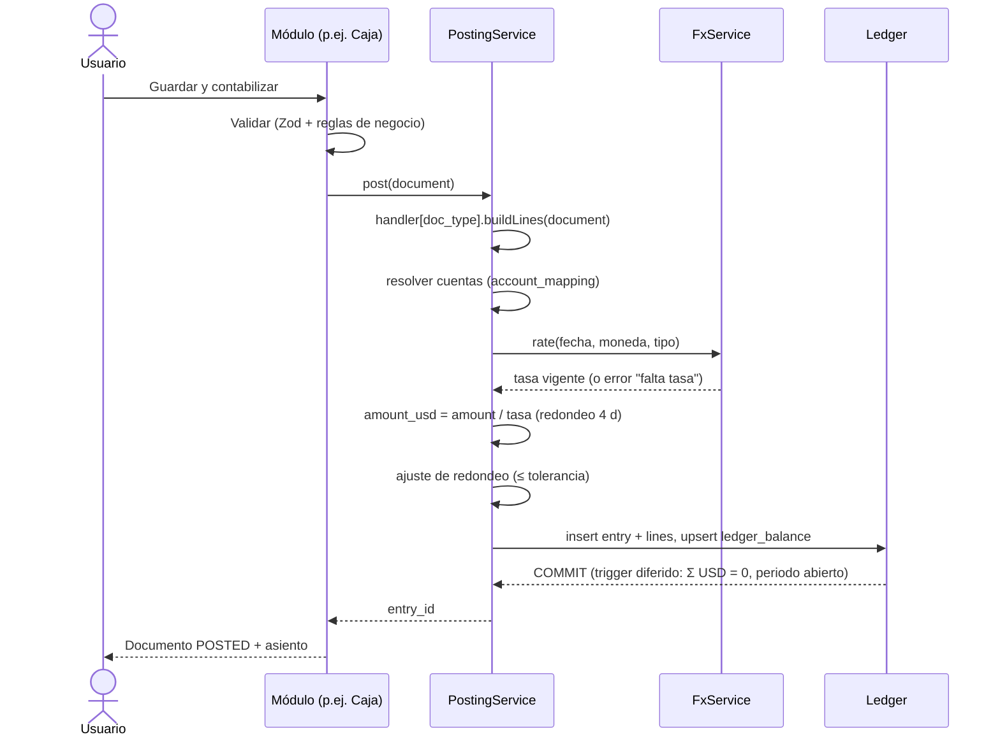

# 03 · Motor contable y monedas

## 1. Flujo de un documento



Todo va en **una única transacción**. Si falla cualquier validación (tasa
ausente, periodo cerrado, descuadre), no se guarda nada.

## 2. Reglas de contabilización

Cada tipo de documento tiene un **handler** en código que decide la estructura
del asiento. Las **cuentas concretas** se resuelven en `account_mapping`, una
tabla editable desde la UI por el Contador:

| mapping_key | empresa | segmento | moneda | cuenta |
|---|---|---|---|---|
| `cash.on_hand` | * | * | CUP | 101.0001 |
| `sales.distribution.retail` | DM | 999 | * | 900.xxxx |
| `fx.realized.loss.exchange` | * | * | * | 845.xxxx (Cambios) |
| `fx.realized.gain.exchange` | * | * | * | 924.xxxx |
| `fx.realized.loss.transfer` | * | * | * | 845.xxxx (Traspasos) |
| `fx.realized.loss.coprove` | * | * | * | 845.xxxx (Pago a Coprove) |
| `fx.holding.loss` / `.gain` | * | * | * | 846 / 925 |
| `transit.bank_to_bank` | * | * | * | 699.xxxx |

La resolución va de lo más específico a lo más general (empresa > segmento >
moneda > comodín). Si no hay mapeo, el documento no se contabiliza y se
muestra qué clave falta.

**Categorías de caja y banco** (lo que hoy es "Referencia cruzada"): un
catálogo `cash_category` en el que cada categoría define su clave de mapeo,
si exige contraparte, el segmento por defecto y la categoría del EFE. Así el
usuario sigue eligiendo "Gastos varios (Distribución)", pero el sistema sabe
a qué cuenta va.

## 3. Monedas y tasas

- **Convención:** `1 USD = X unidades` (igual que la hoja `Tasas`), de modo que
  `importe_usd = importe / tasa`. La excepción `CUP/EUR (OC)` se guarda con
  `base = EUR`, y el USD se obtiene en cadena (CUP→EUR→USD) cuando se pida
  explícitamente.
- **Búsqueda de tasa:** la del día exacto (`rate_date, currency, rate_type`).
  Si no existe, la última anterior, con una antigüedad máxima configurable
  (p. ej. 7 días). Pasado ese límite, el documento se bloquea con "falta tasa".
  Una tasa ≤ 0 es inválida (en el Excel provoca los `#DIV/0!`).
- **Tipo de tasa por defecto:** se define por categoría de documento y cuenta
  (p. ej. caja CUP → IC; banco DOP → ORD) y el usuario puede cambiarlo línea a línea.
- **Cada línea guarda:** moneda, importe original, tasa, tipo de tasa e importe USD.
- **Precisión:** tasas `NUMERIC(20,10)`, importes `NUMERIC(18,4)` con redondeo
  half-even por línea. La diferencia de redondeo de un asiento multimoneda
  (≤ 0,01 USD) va a una cuenta de redondeo. Si supera la tolerancia, error.

## 4. Ejemplos de asientos

Tasas de ejemplo: CUP (IC) 400, EUR (IC) 0,90, DOP (ORD) 60.

### 4.1 Venta minorista en efectivo CUP (Distribución, PV "1ra y 12")

| Cuenta | Moneda | Importe | Tasa | USD | Dimensiones |
|---|---|---:|---:|---:|---|
| 101.0001 Caja CUP | CUP | 12.000,00 | 400 | 30,0000 | 999 · PV 1ra y 12 |
| 900.xxxx Ventas minoristas | CUP | −12.000,00 | 400 | −30,0000 | 999 · PV 1ra y 12 · contenedor C-045 |
| 814.xxxx Costo de ventas | USD | 18,00 | 1 | 18,0000 | 999 · C-045 |
| 181.xxxx Mercancías Distribución | USD | −18,00 | 1 | −18,0000 | 999 · C-045 |

### 4.2 Traspaso banco → banco con cambio (USD BHD → EUR Bankinter)

Un **solo documento `transfer`** con dos patas que pasan por la 699:

| Fecha | Cuenta | Moneda | Importe | USD |
|---|---|---|---:|---:|
| 02/05 | 699.xxxx Transitoria banco↔banco | USD | 1.000,00 | 1.000,00 |
| 02/05 | 109.0027 BHD USD | USD | −1.000,00 | −1.000,00 |
| 04/05 | 110.xxxx Bankinter EUR | EUR | 890,00 (@0,90) | 988,89 |
| 04/05 | 699.xxxx Transitoria | USD | −988,89 | −988,89 |
| 04/05 | 845.xxxx Variación TC – Traspasos | USD | 11,11 | 11,11 |
| 04/05 | 699.xxxx Transitoria | USD | −11,11 | −11,11 |

El documento queda abierto en la 699 hasta que llega la pata de entrada. Un
informe muestra los traspasos "en tránsito". Cuando el documento se completa,
la 699 vuelve a 0 y la diferencia va a 845/924. Si la diferencia es por
comisión bancaria, el usuario la separa a la 831.

### 4.3 Cambio de divisa en caja (venta de USD por CUP)

| Cuenta | Moneda | Importe | Tasa | USD |
|---|---|---:|---:|---:|
| 101.0001 Caja CUP | CUP | 41.000,00 | 400 | 102,5000 |
| 101.0002 Caja USD | USD | −100,00 | 1 | −100,0000 |
| 924.xxxx Ingreso Variación TC – Cambios | USD | −2,50 | 1 | −2,5000 |

### 4.4 Pago a Coprove con diferencia cambiaria

Factura de 10.000 EUR registrada a 0,92 (10.869,57 USD) y pagada a 0,90 (11.111,11 USD):

| Cuenta | Moneda | Importe | USD |
|---|---|---:|---:|
| 407 CxP Coprove | EUR | 10.000,00 | 10.869,57 |
| 845.xxxx Variación TC – Pago a Coprove | USD | 241,54 | 241,54 |
| 110.3803 Banco EUR | EUR | −10.000,00 | −11.111,11 |

El `settlement` guarda la vinculación factura ↔ pago y la diferencia realizada.

### 4.5 Revaluación de fin de mes (tenencia)

El proceso mensual recorre todas las cuentas con `reval_rate_type` informado
(caja, bancos, y CxC/CxP en moneda extranjera por contraparte):

```
saldo_orig     = Σ amount        (hasta fin de mes)
saldo_usd      = Σ amount_usd    (hasta fin de mes, incluidas revaluaciones previas)
valor_cierre   = saldo_orig / tasa(último día del mes, reval_rate_type de la cuenta)
diferencia     = valor_cierre − saldo_usd   → 846 (pérdida) / 925 (ganancia)
```

Ejemplo: Caja EUR, saldo 5.000 EUR contabilizado en 5.400 USD. Con una tasa de
cierre de 0,90, vale 5.555,56 USD:

| Cuenta | Moneda | Importe | USD |
|---|---|---:|---:|
| 101.0003 Caja EUR | EUR | 0,00 | 155,56 |
| 925.xxxx Ingresos por Tenencia – Efectivo | USD | −155,56 | −155,56 |

- Se usan líneas con importe original 0 y USD ≠ 0: solo cambia la valoración.
- **Sin reversión** el día 1: la revaluación deja el saldo USD a tasa de cierre,
  igual que hace hoy el BC (`saldo / tasa fin de mes`). Así el saldo de balance
  coincide con el Excel por construcción.
- Es idempotente: si se vuelve a ejecutar un mes, se anula la corrida anterior
  y se recalcula. Se ejecuta antes del cierre y se puede repetir mientras el
  periodo no esté bloqueado.
- La diferencia se desglosa por cuenta, moneda y contraparte
  (`fx_revaluation_line`). Es el equivalente a las hojas `Tenencia_Efectivo` y
  `Tenencia_CXC`.

### 4.6 Venta interna KEI → GR (eliminación en consolidación)

En KEI: CxC GR (contraparte = empresa del grupo) contra **1900** Ventas
internas, y **1814** Costo interno contra 180 Mercancías Exportación. En GR:
181 Mercancías contra CxP KEI. Todas las líneas llevan `counter_company_id`.
La consolidación elimina 1900/1814–1817 y compensa CxC/CxP intercompañía
por pares. Un control avisa si los saldos recíprocos no cuadran.

### 4.7 Sobrevaloración interna (costo 999 vs 888)

La diferencia `costo_999 − costo_888` de cada línea de venta se registra en la
**1816** contra la **1181** (tal como hace hoy la fila 305 del BC). En la vista
consolidada estas cuentas se eliminan.

## 5. Libros Real y Fiscal

- `book = BASE`: todo lo común (la gran mayoría).
- `book = REAL`: lo que solo existe en la gestión interna. Por ejemplo, el
  costo real del contenedor si difiere del fiscal.
- `book = FISCAL`: ajustes que solo existen en lo presentado (costo fiscal, PV
  fiscal, ONAT presentado).
- Las vistas de reportes son **Real = BASE + REAL** y **Fiscal = BASE + FISCAL**.
- Los costos de distribución en dos versiones (`container_cost.version`) generan
  automáticamente el asiento BASE con el importe común y un ajuste REAL o FISCAL
  por la diferencia.

## 6. Periodos y cierres

| Estado | Quién contabiliza | Uso |
|---|---|---|
| `OPEN` | Todos según su rol | Mes en curso |
| `SOFT_CLOSED` | Solo Contador/Admin | Revisión del cierre |
| `LOCKED` | Nadie. Reabrir exige Admin, motivo y queda en la auditoría | Mes cerrado |

**Checklist de cierre mensual** (asistente en la UI):
1. Tasas del mes completas (no falta ningún día hábil por tipo usado).
2. Bandeja de revisión vacía para el mes.
3. Traspasos en tránsito (699) revisados.
4. Conciliaciones bancarias del mes hechas.
5. Devengos: nómina, impuestos (ONAT trimestral, Hacienda anual), intereses de
   financiamientos y comisiones pendientes.
6. Revaluación (tenencia).
7. BC cuadrado: Σ USD = 0 y Activo = Pasivo + Patrimonio + Resultado. Si no
   cuadra, **no se puede bloquear el mes**.
8. Bloqueo.

**Cierre anual:** asiento de cierre en el periodo 13 (resultado → 630
Utilidades retenidas) y asiento de apertura en el periodo 0 del año siguiente.
La distribución de resultados por socio se registra como documento de Capital.

## 7. Anulación

Anular un documento crea un **contra-asiento** (mismas líneas con signo
invertido, `reverses_id` → original) con la fecha que elija el usuario (por
defecto la original si el periodo está abierto, o el día 1 del primer periodo
abierto). El documento pasa a `VOIDED` y nada se borra.

## 8. Tests del motor (obligatorios en CI)

- Propiedad: todo asiento generado por cualquier handler cuadra en USD
  (*property-based testing* con fast-check sobre documentos aleatorios).
- Conversión: casos límite de redondeo, tasas muy grandes (CUP), muy pequeñas
  (inversas) y cadenas CUP→EUR→USD.
- Revaluación: idempotencia; saldo USD tras revaluar = saldo_orig / tasa de cierre.
- Traspasos: la 699 vuelve a 0 al completarse; diferencia → 845/924.
- Inmutabilidad: `UPDATE` sobre un asiento POSTED → error de base de datos.
- Periodos: contabilizar en LOCKED → error; en SOFT_CLOSED solo como Contador.
- Consolidación: eliminaciones intercompañía cuadran por pares.
- *Golden tests* de reportes: para un dataset de demo fijo, el BC, ES y ER
  esperados se guardan como fixtures.
